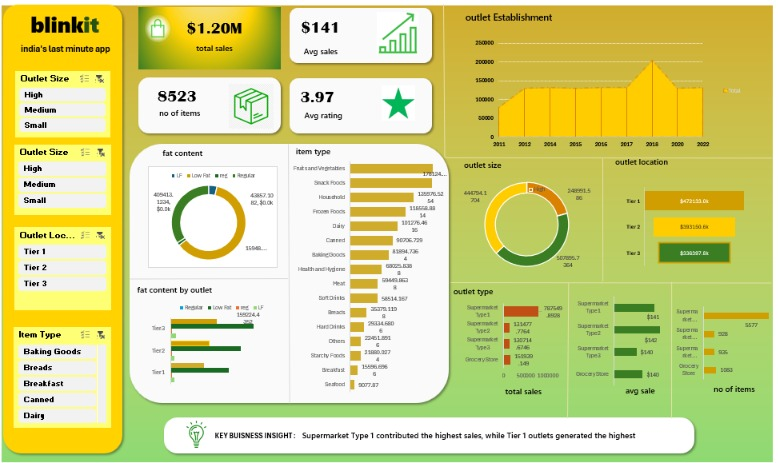

# 🛒 Blinkit Data Analysis Dashboard

## 📌 Overview

This project presents an interactive **Microsoft Excel dashboard** built using Blinkit sales data. The objective was to transform raw transactional data into meaningful business insights through data cleaning, analysis, and visualization.

The dashboard provides an interactive view of sales performance across outlet types, locations, item categories, and customer preferences using KPIs, Pivot Tables, Pivot Charts, and Slicers.

---

## 🎯 Objectives

- Analyze overall sales performance
- Compare outlet performance by size and location
- Identify top-performing product categories
- Understand customer preferences based on fat content
- Build an interactive dashboard for business decision-making

---

## 📊 Dashboard KPIs

- **Total Sales:** $1.20M
- **Average Sales:** $141
- **Number of Items:** 8,523
- **Average Rating:** 3.97

---

## 📈 Dashboard Features

- Interactive Slicers
- KPI Cards
- Outlet Establishment Trend
- Sales by Item Type
- Outlet Size Analysis
- Outlet Location Analysis
- Fat Content Distribution
- Fat Content by Outlet
- Outlet Type Comparison

---

## 💡 Key Insights

- Tier 1 outlets generated the highest overall sales.
- Fruits & Vegetables emerged as the best-performing product category.
- Supermarket Type 1 contributed the highest revenue.
- Product sales varied significantly across outlet sizes and locations.

---

## 🛠️ Tools & Skills

- Microsoft Excel
- Pivot Tables
- Pivot Charts
- Slicers
- Data Cleaning
- Dashboard Design
- Data Visualization
- KPI Reporting
- Business Analysis

---

## 📁 Project Structure

```text
blinkit-data-analysis-dashboard/
│── BlinkIT Grocery Data Excel.xlsx
│── dashboard-preview.png
│── README.md
```

---

## 📷 Dashboard




---

## 📚 What I Learned

- Designing interactive Excel dashboards
- Creating business-focused KPIs
- Transforming raw data into actionable insights
- Building effective visualizations for decision-making
- Improving dashboard usability with interactive filters
